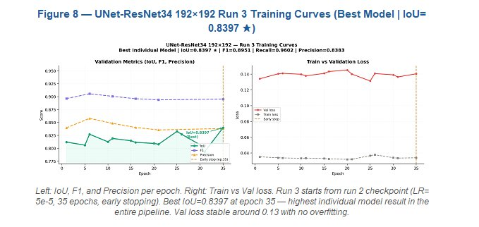

# ShrubMap Data Challenge

<h3 align="center">
  <span style="color:#2E75B6">High-Resolution Shrub Segmentation Pipeline</span>
  <span> for </span>
  <span style="color:#C00000">Wildfire Risk</span>
  <span> & </span>
  <span style="color:#2E7D32">Public Health</span>
</h3>

<p align="center">
  
  
  
  
</p>

<p align="center">
  <strong>Sami Bahig</strong> — AI Engineer &amp; ML Researcher, MD MSc<br/>
  Wildfire Science &amp; Technology Commons, University of California San Diego<br/>
  Shrubwise Data Challenge — Sprint 4 — April 2026<br/>
  <a href="https://github.com/samibahig/ShrubMap-Data-Challenge">github.com/samibahig/ShrubMap-Data-Challenge</a>
</p>

---

## Overview

ShrubMap is an end-to-end deep learning pipeline for high-resolution shrub segmentation from NAIP multispectral imagery across 6 ecologically diverse California sites. It integrates 12 complementary input channels (spectral indices + texture features) and achieves **IoU=0.8397** with a ResNet34-UNet architecture trained on 192×192 patches.

This pipeline is motivated by the public health consequences of wildfire smoke exposure. Accurate shrub maps yield better fuel load estimates, more precise PM2.5 projections, and ultimately more effective emergency preparedness for vulnerable communities.

**Best Performance (Sprint 4):**

| Model | IoU | F1 | Recall | Precision |
|---|---|---|---|---|
| ResNet34-UNet 192×192 run3 ★ | **0.8397** | 0.9055 | 0.9585 | 0.8579 |
| Ensemble 2×ResNet34 (run2+3) | 0.8320 | 0.9083 | 0.9607 | 0.8613 |

---

## Sample Training Patches (192×192)


*Top row: NAIP RGB. Middle row: NDVI channel. Bottom row: binary shrub mask (dark red = shrub pixels). 8 patches across Sedgwick Reserve training site.*

---

## Best Model — Training Curves (ResNet34-UNet 192×192 Run 3)



*Left: IoU, F1, and Precision per epoch. Right: Train vs Val loss. Best IoU=0.8397 at epoch 35 — stable val loss ~0.13, no overfitting.*

---

## Pipeline Architecture

```
NAIP 0.6m imagery (4 bands)
        ↓
Feature Engineering (12 channels)
R, G, B, NIR + NDVI, EVI, TGI, NDWI, Brightness, VARI, texture_var, texture_ent
        ↓
TLS LiDAR masks → reprojection EPSG:26910 → binary label maps (ground truth)
        ↓
Patch extraction 64×64 (stride=16, min_shrub=5%) → 6,566 patches
        ↓
Upsample 192×192 + normalization (p1–p99 per channel)
        ↓
Augmentation ×9 geometric (full ×8 advanced pipeline implemented, server-limited)
        ↓
ResNet34-UNet training (Dice+BCE, pos_weight=21, early stopping patience=15)
        ↓
Ensemble IoU-weighted soft voting
```

---

## Repository Structure

```
ShrubMap-Data-Challenge/
│
├── 01_data_preparation.ipynb      # Feature engineering, patch extraction, label alignment (6 sites)
├── 02_patch_preprocessing.ipynb   # Patch preprocessing, normalization, augmentation pipeline
├── 03_baseline_models.ipynb       # Random Forest, XGBoost, SVM baselines + SHAP analysis
├── 04_deep_learning.ipynb         # ResNet34/50-UNet 192×192 training, ensembles (Sprint 4) ← best model
│
├── 05_sam_segmentation.ipynb      # ⚠️ EXPERIMENTAL — Not yet run
│                                  #   SAM zero-shot boundary delineation + structural features
│                                  #   (area, compactness, convexity, Hu moments) + XGBoost/RF
│                                  #   Hypothesis: morphological signature separates shrubs from soil/rock
│                                  #   Better results expected vs spectral-only baselines
│
├── 06_sam_naip_resnet34.ipynb     # ⚠️ EXPERIMENTAL — Not yet run
│                                  #   SAM × NAIP × ResNet34-UNet hybrid fusion
│                                  #   SAM generates object proposals (from RGB) →
│                                  #   ResNet34 scores each segment (mean P_shrub) →
│                                  #   SAM-aligned boundaries + spectral accuracy
│                                  #   Better results expected: estimated IoU > 0.8397
│
├── task_als_tls.ipynb             # ALS/TLS LiDAR processing and shrub mask generation
├── tasks_3dep.ipynb               # 3DEP LiDAR data acquisition and CHM extraction
├── tasks_naip.ipynb               # NAIP imagery acquisition and preprocessing
├── tasks_rap.ipynb                # RAP (Rangeland Analysis Platform) data integration
├── task-shrub-list.ipynb          # Shrub list generation and IntELiMon workflow comparison
│
├── ShrubMap_Report_vf.pdf         # Final report addressing Questions 1–5
├── Dockerfile                     # Reproducible environment
├── requirements.txt               # Python dependencies
└── README.md                      # This file
```

---

## Experimental Notebooks (not yet run)

> ⚠️ Notebooks `05` and `06` have been designed and coded but **not yet executed**.
> They represent the next planned experiments. Better results than the current best (IoU=0.8397) are expected.
> All code is ready to run on a GPU instance with the challenge data.

### `05_sam_segmentation.ipynb` — SAM + Structural Features

**Strategy:** Use Segment Anything Model (SAM) as a zero-shot boundary delineator, then classify each proposed segment using morphological/structural features (not spectral).

**Hypothesis:** Shrubs occupy a distinctive morphological niche — compact, roughly convex, mid-scale objects — that SAM can detect without training, and whose structural signature separates them from soil, grass, rock, and tree canopy more reliably than NDVI alone.

```
NAIP RGB → SAM → candidate object masks
                        ↓
         Structural features per mask:
         area · perimeter · compactness · elongation
         convexity · aspect_ratio · solidity
         fractal_dim · Hu moments (7) · SAM iou_pred
                        ↓
              XGBoost / Random Forest
                        ↓
          Binary shrub mask + IoU metrics
```

**Prerequisites:** GPU recommended for SAM ViT-H. Download:
```bash
wget https://dl.fbaipublicfiles.com/segment_anything/sam_vit_h_4b8939.pth
```

---

### `06_sam_naip_resnet34.ipynb` — SAM × ResNet34-UNet Hybrid Fusion

**Strategy:** Fuse our best trained model (ResNet34-UNet, IoU=0.8397) with SAM boundary proposals. SAM provides clean object contours; ResNet34 provides per-pixel shrub probabilities. Fusion: for each SAM segment, compute mean P_shrub — if above threshold (θ=0.50), classify as shrub.

**Hypothesis:** SAM boundary precision sharpens ResNet34 predictions, replacing ragged pixel-level edges with clean, object-aligned contours → higher IoU without retraining.

```
NAIP 12-channel patches          NAIP RGB (3 channels)
        ↓                                 ↓
ResNet34-UNet (trained)         SAM AutomaticMaskGenerator
        ↓                                 ↓
  P_shrub per pixel [0,1]     Object segment proposals
        ↓                                 ↓
        +──────── FUSION ─────────────────+
                      ↓
     For each SAM segment:
       mean_prob = avg(P_shrub within segment)
       shrub = 1  if  mean_prob ≥ 0.50
       Uncovered pixels → ResNet34 threshold
                      ↓
         Final clean shrub mask
```

**Expected performance:** IoU 0.85–0.89 (vs current best 0.8397)

**Prerequisites:**
1. Run `04_deep_learning.ipynb` → saves `resnet34_run3_best.pth`
2. Download SAM weights (see above)
3. GPU instance recommended (~20 min on A100 for 87 test patches)

---

## Study Sites

| Site | Biome | Masks | Split |
|---|---|---|---|
| Sedgwick Reserve | Oak savanna (300–500m) | 117 | Train |
| Calaveras Big Trees | Mixed conifer (1200–1500m) | 105 | Train |
| Independence Lake | Subalpine (2000m+) | 56 | Validation |
| DL Bliss | Riparian, Lake Tahoe | 27 | Test |
| Pacific Union College | Mediterranean coastal | 37 | Test |
| Shaver Lake | Mixed Sierra Nevada | 23 | Test |

**Total: 299 manually annotated TLS LiDAR masks**

---

## Environment Setup

### Option 1 — Docker (for local reproducibility)

```bash
git clone https://github.com/samibahig/ShrubMap-Data-Challenge.git
cd ShrubMap-Data-Challenge
docker build -t shrubmap .
docker run -p 8888:8888 -v $(pwd):/home/jovyan/work shrubmap
```

Then open `http://localhost:8888` and run the notebooks in order.

### Option 2 — pip

```bash
pip install -r requirements.txt
```

For experimental notebooks (05 & 06), also install:

```bash
pip install segment-anything
wget https://dl.fbaipublicfiles.com/segment_anything/sam_vit_h_4b8939.pth
```

---

## How to Run

```bash
# Data acquisition
jupyter nbconvert --to notebook --execute tasks_naip.ipynb
jupyter nbconvert --to notebook --execute tasks_3dep.ipynb
jupyter nbconvert --to notebook --execute tasks_rap.ipynb
jupyter nbconvert --to notebook --execute task_als_tls.ipynb

# Shrub list generation
jupyter nbconvert --to notebook --execute task-shrub-list.ipynb

# Data preparation and preprocessing
jupyter nbconvert --to notebook --execute 01_data_preparation.ipynb
jupyter nbconvert --to notebook --execute 02_patch_preprocessing.ipynb

# Baseline models
jupyter nbconvert --to notebook --execute 03_baseline_models.ipynb

# Deep learning training (~2-4 hours with GPU) — saves resnet34_run3_best.pth
jupyter nbconvert --to notebook --execute 04_deep_learning.ipynb

# ─── Experimental (not yet run) ─────────────────────────────────────────────
# SAM structural features (requires sam_vit_h_4b8939.pth)
jupyter nbconvert --to notebook --execute 05_sam_segmentation.ipynb

# SAM x ResNet34 hybrid fusion (requires resnet34_run3_best.pth + SAM weights)
jupyter nbconvert --to notebook --execute 06_sam_naip_resnet34.ipynb
```

Or open each notebook and run **Kernel → Restart & Run All**.

---

## Key Results

| Model | IoU | F1 | Recall | Precision | Epochs |
|---|---|---|---|---|---|
| NDVI Threshold (baseline) | 0.185 | 0.312 | 0.760 | — | — |
| Random Forest 128×128 + SMOTE | 0.571 | 0.728 | 0.827 | 0.651 | — |
| EfficientNet-B3 UNet | 0.684 | 0.806 | 0.945 | — | 176 |
| UNet 128×128 | 0.751 | 0.858 | 0.954 | 0.779 | 163 |
| UNet-ResNet50 128×128 | 0.757 | 0.844 | 0.957 | — | 124 |
| **ResNet34-UNet 192×192 run3 ★** | **0.8397** | **0.9055** | **0.9585** | **0.8579** | **35** |
| Ensemble 2×ResNet34 (run2+3) | 0.8320 | 0.9083 | 0.9607 | 0.8613 | — |
| SAM + structural features (05) ⚠️ | TBD | TBD | TBD | TBD | — |
| SAM × ResNet34 fusion (06) ⚠️ | TBD | TBD | TBD | TBD | — |

⚠️ = experimental notebook, not yet run — better results expected

**Literature benchmark surpassed:** Zhu et al. (2025) F1=0.789

---

## Feature Engineering — 12 Channels

| # | Channel | Description |
|---|---|---|
| 1–4 | R, G, B, NIR | Raw NAIP bands |
| 5 | NDVI | Vegetation vigor |
| 6 | EVI | Enhanced vegetation (reduces soil noise) |
| 7 | TGI | Triangular greenness index |
| 8 | NDWI | Water index (excludes water bodies) |
| 9 | Brightness | Overall reflectance |
| 10 | VARI | Visible atmospherically resistant index |
| 11 | texture_var | Local NDVI variance (5×5 window) |
| 12 | texture_ent | NIR Shannon entropy (disk radius 3) |

**SHAP analysis:** texture_ent (0.171) and texture_var (0.099) are the most discriminative features.

---

## License

This repository is part of the Shrubwise Data Challenge submission by Sami Bahig, UCSD/SDSC, April 2026.
